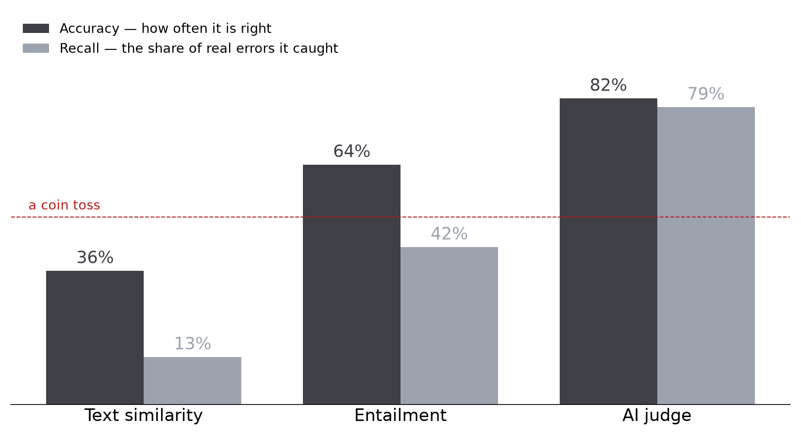
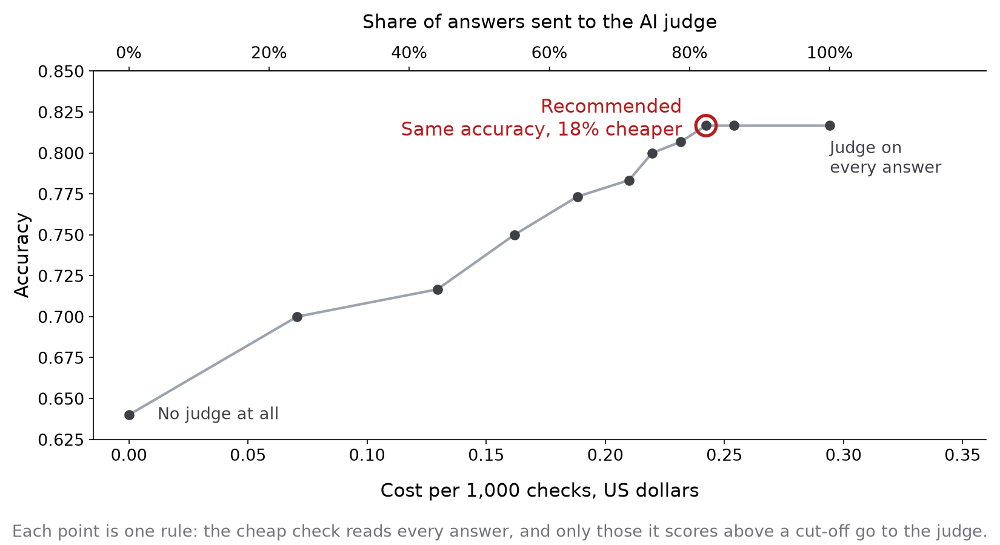

# AI Output Auditor

**You gave a document to an AI and asked it something. Did the answer stay inside your document?**

Paste the document and the AI's answer. The tool reads both and tells you whether the answer is
supported — and says what it considers unsupported.

**[→ Try it](https://huggingface.co/spaces/Evkoff/ai-output-auditor)** · free, no account needed

---

## The finding

Three ways of detecting a hallucination, measured head to head on the same 300 human-labelled
answers. The obvious one does not work.

| Method | Accuracy | Precision | Recall | F1 | Cost per 1,000 checks | Median wait |
|---|---|---|---|---|---|---|
| Text similarity — `all-MiniLM-L6-v2` | 0.357 | 0.235 | 0.127 | 0.165 | free | 11 ms |
| Entailment — `HHEM-2.1-Open` | 0.640 | 0.750 | 0.420 | 0.538 | free | 55 ms |
| **AI judge — `gpt-oss-120b`** | **0.817** | **0.832** | **0.793** | **0.812** | $0.29 | 1,091 ms |

The set is balanced — 150 records, each giving one faithful answer and one hallucinated — so a coin
toss scores 0.500. **Comparing the two texts for similarity scores 0.357: worse than guessing.**



**Recall is the number this product lives on.** An error that reaches you unflagged is the failure
it exists to prevent, and text similarity catches 13% of them.

### A cheaper configuration exists, and it was not shipped

Entailment scores every answer from 0 to 1. Below 0.2 it has already found the problem: on those 53
answers it is right 47 times, and the judge, asked the same 53, is also right 47 times. Above 0.2
the judge adds between 8 and 50 points in every band of the scale.

So: trust the cheap score below 0.2, send the other 82% to the judge. **Same accuracy, 18% less
cost, and slightly better recall.** The threshold was read off the data, not chosen.



It is not in the product. The 18% it skips are answers that get no explanation — and the
explanation is what the product is for.

---

## How it works

Three detectors behind one interface, each answering a different question about the same pair of
texts.

| | What it asks | Where it runs |
|---|---|---|
| **Text similarity** | How close is the answer to the document in wording? | locally, free |
| **Entailment** | Does the answer follow from the document? | locally, free |
| **AI judge** | What in this answer is not supported? | Groq's free tier |

They share one `Detector` protocol and one harness, which is what makes the comparison fair: one
loop, one set of rules, no per-detector special cases.

The verdict on screen comes from the judge, because it is the only method that can explain itself.
The other two stay visible, because when they disagree that is information.

---

## What it does not do

- **It checks grounding, not truth.** A faithful summary of a wrong document is marked supported.
- **It explains, it does not locate.** The judge describes what it considers unsupported, in its own
  words. It does not mark a span in your text.
- **English only.** HHEM is trained on English and HaluEval is an English dataset.
- **10,000 characters across both fields.** The limit comes from measured memory, not from a token
  budget: HHEM needs 2 GB at 10,000 characters and 6 GB at 25,000, on a server with 16 GB shared.
- **You supply the source.** Without a document there is nothing to check an answer against.

---

## How it was measured

**Data.** [HaluEval](https://github.com/RUCAIBox/HaluEval) — human-labelled hallucinations. Two
subsets are used, question-answering and summarization; the dialogue subset was dropped before any
detector ran, because its scenario (chatbot turns against knowledge-graph triples) is not one this
product's user ever meets.

**The split is by record, not by case.** Each record yields two cases that share a source text, so
splitting by case would leak that text between the splits. 150 records went to dev, 150 to test.

**Thresholds were tuned on dev and applied to test unchanged.** Two of the three methods return a
score rather than a verdict, so a cut-off has to be chosen somewhere. Tuning it on the data you
report would inflate every number invisibly — nothing fails, the results simply come out prettier
than they are.

**Every judge answer is cached to disk.** A run spanning two days of a free quota cannot be lost to
one crash, and the cache doubles as the record the analysis is written from.

```bash
python run_eval.py      # run every detector over a split
python analyze.py       # metrics per method and per subset, cost, latency
python cascade.py       # what a cheap-first cascade would have scored and cost
python charts.py        # redraw the two figures above
```

---

## Where each method fails

Named rather than implied. Full detail with counts and examples is in the evaluation notes.

**Text similarity fails in opposite directions on the two subsets.** 57 of its 62 false alarms are
in question-answering, where the answer is a name and the source is a paragraph, so the texts look
nothing alike whatever the answer says. 75 of its 131 misses are summaries, where the summary reuses
the document's own words whether or not a fact was invented. No threshold fixes both.

**Every one of the judge's 24 false alarms is of one kind** — `not_mentioned`, never `contradicted`.
It never says "your document says otherwise"; it says "your document does not say this".

**Some of those are not errors at all.** HaluEval labels an answer faithful when it is true *in the
world*. This product asks whether *your document* supports it. One summary claims a man spent 66
days at sea; the number appears nowhere in the 8,247-character source and cannot be derived from it.
The label says faithful, the judge says unsupported, and by this product's definition the judge is
right. **0.817 is a floor, not a ceiling** — how far below the ceiling was not measured.

**The benchmark passes the judge a question that the product does not.** Half the test data is
question-answering, and the judge's prompt included the question. The screen has no question field.
So the measured accuracy describes a slightly easier task than the one that ships.

---

## Ethics

**A checker that is right 82% of the time creates a new risk.** "No error found" is trusted more
than no check at all, and it is wrong about one time in five. The screen says so under every
verdict: checked by an AI, right about 8 times in 10, a signal rather than a guarantee.

**A false alarm has a cost too.** 24 correct answers were flagged, every one for saying something
the document merely did not mention. The tool can make a right answer look wrong, and a reader
without the expertise to overrule it will believe it.

**Your document leaves your machine.** Two of the three methods run locally, but the judge sends
your text to a third-party API. Nothing is stored — the deployment has no persistent storage — but a
contract you paste is a contract you have sent somewhere.

**The benchmark is not the world.** HaluEval's hallucinations were generated by prompting a model,
so they may be more stylised than real ones. Fourteen real AI answers were checked by hand across
three vendors and none contained an invented claim: with the source attached and a direct
instruction, current models largely hold up. The risk lives in long and complex documents — which is
exactly where the 10,000-character limit bites hardest.

**Which failure is worse is a product question, not a modelling one.** A miss ships an invention to
the reader; a false alarm makes them doubt a correct answer. Which to prefer depends on whether
someone is checking a contract or skimming a chat log, and the threshold is where that choice is
made.

---

## Running it locally

```bash
python -m venv .venv && source .venv/bin/activate
pip install -r requirements.txt
echo "GROQ_API_KEY=your_key_here" > .env     # free tier, no payment method needed
python app.py
```

The two local models download themselves on first run. The judge needs a
[Groq](https://console.groq.com) key; without one the other two methods still work and the screen
says so.

---

## What is in here

| | |
|---|---|
| `app.py` | The product. Gradio, two tabs, the three detectors |
| `src/base.py` | The `Detector` protocol every method implements |
| `src/embeddings.py` · `entailment.py` · `llm_judge.py` | The three methods |
| `src/halueval.py` | Loading the dataset and splitting it by record |
| `src/harness.py` | One loop for all three, with a token budget and a cache |
| `src/cache.py` · `src/metrics.py` | Result storage; accuracy, precision, recall, F1 |
| `run_eval.py` · `analyze.py` · `cascade.py` · `charts.py` | Evaluation and analysis |
| `examples.py` | Two worked examples shown in the interface |

---

## Next

**Scale** — past 10,000 characters the tool would split the document itself and send the judge only
the parts related to the answer. **Adoption** — a link it fetches, a file it opens, or an add-on
that reads both texts out of any AI chat, instead of two copy-pastes. **Precision** — ask the judge
to quote rather than describe, so a claim can actually be marked. **Cost** — the cascade above,
once a skipped answer can still carry an explanation.

---

Capstone project for the Developers Institute GenAI bootcamp, 2026.
Built by [Evgeniya Kolesnikov](https://www.linkedin.com/in/evgeniya-kolesnikova/).
